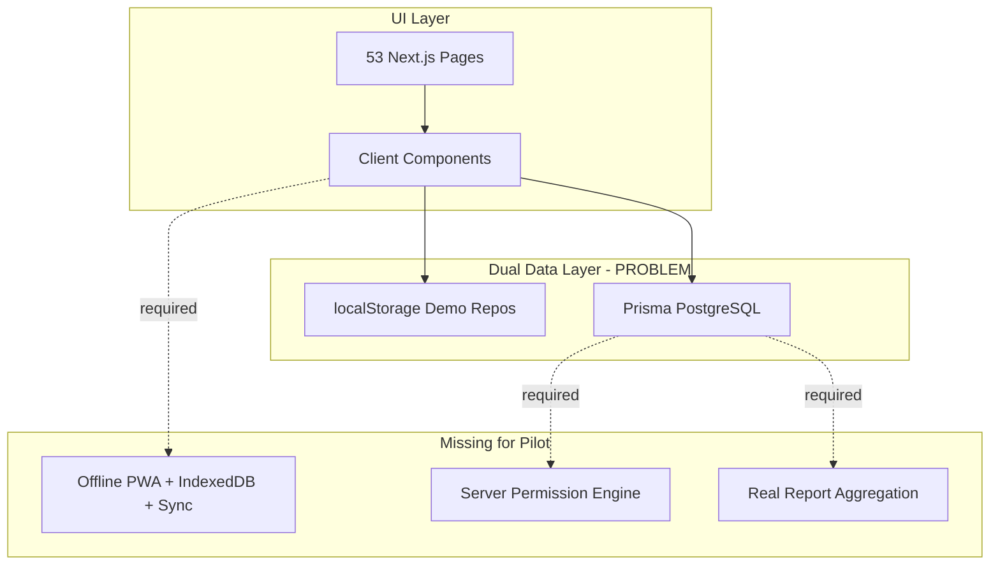

# EGO POS — Complete Architecture & Implementation Audit

**Audit date:** 21 June 2026  
**Auditor basis:** Live source code inspection + `MASTER_SPECIFICATION.md` + confirmed Go BOX pilot criteria  
**Scope:** 15 audit areas across documentation, architecture, workflows, integrations, production readiness  
**Code modified:** None

---

## Executive Summary

EGO POS is a **mature UI prototype with a production-grade database schema** and **partial Prisma integration**. The codebase evolved from IGO POS through many phases; user-facing branding is **EGO POS** while internal identifiers retain **IGO** naming.

**Architecture pattern:** Next.js 16 modular monolith — `app/` routes, `features/` domain modules, `lib/` shared infra, dual data layer (demo localStorage + PostgreSQL).

**Verdict:** **NO-GO** for Go BOX Pilot Launch (~49% production readiness). See `PRODUCTION_READINESS_REPORT.md` and `CRITICAL_ISSUES.md`.

---

## Audit Criteria Reference

| Source | Rule |
|--------|------|
| Primary spec | `MASTER_SPECIFICATION.md` |
| Code conflicts | Spec wins |
| Go BOX reality conflicts | Update spec first, then code |
| Deployment | Vercel + Supabase PostgreSQL, demo off, single prod DB |
| Offline | Required for POS pilot |
| Pilot gate | Sales, inventory, reports, print, no critical errors |

---

## 1. Documentation Completeness

**Overall:** Medium — rich operational docs at repo root; spec folders thin; maps partially stale.

| ID | Severity | Issue | Root cause | Affected modules | Recommended fix |
|----|----------|-------|------------|------------------|-----------------|
| DOC-01 | Medium | Spec folders (`Docs/`, `Database/`, `Design/`, `Roadmap/`, `Prompts/`) contain v1 originals only (6 files); 60+ completion reports at root | Documentation grew ad hoc during phases | All | Consolidate active docs; mark v1 folders as archive |
| DOC-02 | Medium | `MASTER_SPECIFICATION.md` references models not in schema (`CompanyModule`, `Bank`, `QrAccount`, `PrinterProfile`) | Spec ahead of implementation | Settings, printing, QR | Implement models or mark § deferred in spec |
| DOC-03 | Low | `DATA_SOURCE_MAP.md` and `SYSTEM_INTEGRATION_MAP.md` partially stale | Maps not updated as Prisma repos landed | All modules | Refresh maps after each integration milestone |
| DOC-04 | Low (positive) | Core principles in Master Spec align with intended repository architecture | Good design intent | Architecture | Use spec §2 as implementation gate |
| DOC-05 | Medium | Conflicting profit-protection rules: `PERMISSION_AND_APPROVAL_SPEC.md` vs confirmed audit (Owner override) | Multiple spec iterations | Promotions, POS | Reconcile in `MASTER_SPECIFICATION.md`; user criteria wins |

---

## 2. Folder Structure

**Overall:** Good — feature-based modular monolith matches recommended architecture.

```
app/           → 53 pages, 4 route groups (auth, dashboard, platform, igo-admin)
features/      → 14 domain modules, 127 files
components/    → Shared layout, i18n, auth, admin UI
lib/           → auth, db, demo, i18n, validation, api helpers
prisma/        → schema + 4 migrations + seeds
locales/       → ui/en.json, ui/lo.json + platform TS dictionaries
```

| ID | Severity | Issue | Root cause | Affected modules | Recommended fix |
|----|----------|-------|------------|------------------|-----------------|
| FS-01 | Low (positive) | Clear separation: routes vs domain vs infra | Intentional Phase A structure | All | Maintain; avoid business logic in `app/` pages |
| FS-02 | Medium | Duplicate concepts: `features/shifts/` orphaned vs POS `StaffControl` | Parallel development | Shifts, POS | Merge into one shift module wired to `CashSession` |
| FS-03 | Low | 7,500+ files in `.tmp-*` screenshot folders | QA artifact accumulation | Workspace | Add to `.gitignore`; prune from repo |
| FS-04 | Medium | Mock files coexist with prisma-repository in same feature folders | Transitional adapter pattern incomplete | products, inventory, promotions, reports | Complete adapter pattern; isolate mock behind demo flag |

---

## 3. Database Architecture

**Overall:** Strong schema; 66 models, 4 migrations, tenant write helpers.

| ID | Severity | Issue | Root cause | Affected modules | Recommended fix |
|----|----------|-------|------------|------------------|-----------------|
| DB-01 | Low (positive) | 66 Prisma models cover full domain (Company → Backup) | Comprehensive schema design | All | Keep migrations incremental |
| DB-02 | Low (positive) | 4 migrations: baseline, settings, constraints, branch isolation | Phased hardening | Multi-tenant | Continue constraint audits |
| DB-03 | Medium | Child tables (SaleItem, etc.) lack direct `companyId`; rely on parent FK | Normal relational design | All queries | Enforce tenant joins in repository layer |
| DB-04 | Medium | Spec models missing: `CompanyModule`, `Bank`, `QrAccount`, printer tables | Not migrated | Settings, printing | Add or defer in spec |
| DB-05 | Medium | Prisma 7 driver adapter; no inline URL in schema | Modern Prisma pattern | Deployment | Document Supabase pooler + SSL for Vercel |
| DB-06 | Low | `LoginHistory` lacks `companyId` | Platform-user audit design | Auth | Add optional tenant scope for merchant audit |

---

## 4. Multi-Tenant Readiness

**Overall:** Schema-ready; runtime enforcement incomplete for v1 single-branch pilot.

| ID | Severity | Issue | Root cause | Affected modules | Recommended fix |
|----|----------|-------|------------|------------------|-----------------|
| MT-01 | Low (positive) | `TenantContext`, `withTenantTransaction`, `resolveTenantScope` exist | Phase 17 infrastructure | lib/db | Extend to all API routes |
| MT-02 | High | No per-staff branch assignment in DB; login picks main branch | `CompanyUser` has no `branchId` | Auth, settings | Add `UserBranch` or `CompanyUser.branchId`; set session branch at login |
| MT-03 | High | Staff branch UI uses hardcoded placeholders | Settings not wired | Settings | Load branches from Prisma; persist assignment |
| MT-04 | Medium | Branch isolation migration applied; repos apply inconsistently | Partial rollout | Products, reports, payables | Standardize `branchOwnedWhere` everywhere |
| MT-05 | Medium | Supplier payables aggregated by `companyId` only | Missing branch filter | Dashboard, reports | Join through `Purchase.warehouseId ∈ scope.warehouseIds` |
| MT-06 | Low (positive) | v1 single-branch Go BOX compatible if one branch seeded | Pilot scope | Go BOX | Validate single-branch path explicitly in UAT |

**Pilot note:** Single branch v1 is acceptable per criteria; multi-branch architecture must not be broken by fixes.

---

## 5. POS Workflows

**Overall:** Rich demo UI; production path incomplete vs pilot requirements.

| ID | Severity | Issue | Root cause | Affected modules | Recommended fix |
|----|----------|-------|------------|------------------|-----------------|
| POS-01 | Critical | Production snapshot empty customers/QR banks | `getPosSnapshot()` strips data | POS, membership, QR | Load from Prisma/settings (see CRIT-004) |
| POS-02 | Critical | Server sale does not enforce role/discount rules | Client-trusted payload | POS, permissions | Server validation (see CRIT-007) |
| POS-03 | Critical | Shift not persisted; sales not gated | In-memory `StaffControl` | POS, finance | Wire to `CashSession` (see CRIT-010) |
| POS-04 | Critical | Negative stock hard-blocked | Server + client guards | POS, inventory | Warn instead of block (see CRIT-013) |
| POS-05 | High | Hold/resume bills in React state only | No DB/offline persistence | POS | Persist to `Sale` held status or IndexedDB |
| POS-06 | High | Manager discount limit 10% not 20% | Hard-coded in `permissions.ts` L140 | POS | Change to 20%; align Settings UI |
| POS-07 | Medium | Mixed payment UI exists; cashier blocked from non-cash modes | Permission policy | POS | Clarify policy: if mixed payment required for all roles, update cashier allowed actions |
| POS-08 | Medium | Customer display via localStorage | Same-browser only | POS, customer-display | BroadcastChannel/WebSocket for second screen |
| POS-09 | Low (positive) | Barcode scan + product search work | Keyboard wedge + client filter | POS | Ensure unit barcodes in prod catalog |
| POS-10 | Low | Receipt via `window.print()` | No ESC/POS | POS, printing | Integrate printer profiles per spec |
| POS-11 | High | Refund workflow stub only | Not implemented | POS, finance | Full refund flow (see CRIT-009) |

---

## 6. Inventory Workflows

**Overall:** Prisma write paths exist; UI/demo split and negative-stock policy wrong.

| ID | Severity | Issue | Root cause | Affected modules | Recommended fix |
|----|----------|-------|------------|------------------|-----------------|
| INV-01 | Critical | Demo reads mock; writes always hit PostgreSQL | Split in `inventory-service` vs `actions` | Inventory | Unified repository (see CRIT-014) |
| INV-02 | High | No stock-out / transfer Prisma APIs | Only stock-in, adjust, count | Inventory | Implement transfer/out mutations |
| INV-03 | Critical | Negative stock hard-blocked on sale/adjust | `applyAtomicStockDelta` guard | Inventory, POS | Warning + approval path |
| INV-04 | Medium | Stock adjustment no approval gate | Immediate write | Inventory, approvals | Connect to approval service per Manager rules |
| INV-05 | Low (positive) | Warehouse scoping works in Prisma repo | Tenant scope helpers | Inventory | Maintain |
| INV-06 | Low | UI shows "Real database" label unconditionally | Hardcoded string | Inventory UI | Mode-aware status label |

---

## 7. Membership Workflows

**Overall:** Schema and admin UI exist; POS integration largely missing in production.

| ID | Severity | Issue | Root cause | Affected modules | Recommended fix |
|----|----------|-------|------------|------------------|-----------------|
| MEM-01 | Critical | No QR member lookup at POS | `qrMemberCode` unused | POS, customers | Scan/search by QR code |
| MEM-02 | Critical | Tier discount client-only | Not in `completePrismaSale` | POS, membership | Server-side tier discount (see CRIT-012) |
| MEM-03 | High | Points redeem supported server-side; no POS UI | Missing client state | POS | Add redeem field + balance display |
| MEM-04 | Medium | Points earn display uses hardcoded `/10000`; server uses settings | Mismatch | POS, settings | Pass loyalty settings in snapshot |
| MEM-05 | High | Student/VIP plans mock-only | No schema fields for student price | Products, membership | Extend schema or trim UI to match |
| MEM-06 | High | Membership levels UI fields not persisted | DTO whitelists 4 fields | membership-levels | Extend schema or trim UI |
| MEM-07 | High | Member-only promotions leak to guests | Eligibility logic bug | POS checkout | Require membership when targets exist |
| MEM-08 | Low (positive) | Sales without member allowed | Correct per criteria | POS | Maintain |

**Order requirement:** Promotion first → points after — partially correct server-side; tier discount applied too early on client.

---

## 8. Promotion Workflows

**Overall:** Admin UI rich; checkout engine implements subset.

| ID | Severity | Issue | Root cause | Affected modules | Recommended fix |
|----|----------|-------|------------|------------------|-----------------|
| PRO-01 | Critical | Spend threshold + free gift not in checkout | `default: return 0` | POS, promotions | Rule engine (see CRIT-011) |
| PRO-02 | Critical | Negative profit: no Manager warn / Owner override at checkout | Client-only form guard | POS, promotions | Server margin check + approval |
| PRO-03 | High | Free gift = relabeled buy-X-get-Y; no gift SKU line | UI mapping only | Promotions | Gift product auto-add at POS |
| PRO-04 | Low (positive) | One automatic promotion per item | `reduce` picks best | POS | Add unit tests |
| PRO-05 | Medium | Promotions not previewed in POS cart | Applied only at commit | POS | Shared preview service |
| PRO-06 | Medium | Promotion simulation empty in Prisma path | Stub in prisma-repository | Promotions admin | Port mock simulation to server |
| PRO-07 | Medium | `PromotionRule`/`PromotionAction` tables unused | Engine simplified | Promotions | Wire rule builder to checkout |

---

## 9. Reporting Accuracy

**Overall:** Sub-report pages partial Prisma; main hub and profit broken.

| ID | Severity | Issue | Root cause | Affected modules | Recommended fix |
|----|----------|-------|------------|------------------|-----------------|
| REP-01 | Critical | `/reports` hub 100% mock | No server data passed | Reports | Wire to Prisma (see CRIT-005) |
| REP-02 | Critical | `totalProfit: 0` always | Incomplete dto-mapper | Reports | Pass real profit sum (see CRIT-006) |
| REP-03 | High | Production sales metrics = single "All time" row | No period grouping | Reports/sales | Implement daily/weekly/monthly/yearly |
| REP-04 | High | Category breakdown empty in production | Stub in dto-mapper | Reports | Derive from saleItem groupBy |
| REP-05 | Medium | Demo dashboard returns zeros | `emptySnapshot()` | Dashboard | Aggregate from demo repos in demo mode |
| REP-06 | Medium | Cash reconciliation per-shift math bug | Day-total cash reused per shift | Dashboard | Filter by session/time |
| REP-07 | Low | No dedicated cash reconciliation report page | Not built | Reports, finance | Add report from CashSession + SalePayment |
| REP-08 | Low (positive) | Inventory valuation correct in Prisma path | quantity × costPriceLak | Inventory reports | Maintain |

**Financial accuracy gate:** 5 required reports — **all fail or partial** in current production path.

---

## 10. Localization Completeness

**Overall:** ~540 UI keys in lo/en parity; runtime repair layer and hardcoded strings remain.

| ID | Severity | Issue | Root cause | Affected modules | Recommended fix |
|----|----------|-------|------------|------------------|-----------------|
| LOC-01 | Low (positive) | 540 keys in both `locales/ui/en.json` and `lo.json` | Localization rebuild | UI | CI key parity check |
| LOC-02 | High | DOM runtime repair still mounted | Interim bridge not removed | `app/layout.tsx`, i18n | Migrate strings; remove repair runtime |
| LOC-03 | High | Dual dictionary systems | `dictionaries.ts` + `ui.json` | Auth, platform, dashboard | Consolidate to one source |
| LOC-04 | Medium | Hardcoded English in products, reports, dashboard | Incomplete migration | Multiple components | Replace with `t()` keys |
| LOC-05 | Low | Server `t()` defaults to English without document | Client-only locale detection | lib/i18n | Pass locale from session |
| LOC-06 | Low | Locale in localStorage even in prod-capable builds | Demo storage key reused | i18n | Prod: User/Company preference in DB |

**Spec violation:** Master Spec §23 — no hardcoded user-facing strings after rebuild — **not met**.

---

## 11. Permission System

**Overall:** Client POS policy exists; server enforcement weak; demo bypass critical.

| ID | Severity | Issue | Root cause | Affected modules | Recommended fix |
|----|----------|-------|------------|------------------|-----------------|
| PER-01 | Critical | Demo mode bypasses `assertPermission` | Early return in demo | All writes | Remove bypass (see CRIT-002) |
| PER-02 | Critical | Two disconnected models: POS client policy vs server WRITE_PERMISSIONS | Parallel implementations | POS, lib/auth | Single authorization service |
| PER-03 | Critical | PIN override not implemented | Not built | POS | Manager/Owner PIN modal + server verify (see CRIT-008) |
| PER-04 | High | Manager max discount 10% vs required 20% | Hard-coded | POS permissions | Update to 20% |
| PER-05 | High | Settings permission matrix is UI-only local state | Not persisted/enforced | Settings | Persist to DB; enforce on server |
| PER-06 | Medium | Cashier rules correct on client only | No server mirror | POS | Server deny-list on sale payload |
| PER-07 | Low (positive) | Owner short-circuit on client | Expected | POS | Add audit for Owner actions |

---

## 12. Approval System

**Overall:** Demo localStorage approvals; production DB `Approval` model unused.

| ID | Severity | Issue | Root cause | Affected modules | Recommended fix |
|----|----------|-------|------------|------------------|-----------------|
| APR-01 | Critical | Refund approval flow not implemented | Stub only | POS, finance | Build refund + approval (see CRIT-009) |
| APR-02 | High | Discount approval Owner-only; Manager should approve to 20% | `resolvePendingApproval` logic | POS | Manager path within 20% |
| APR-03 | High | Stock adjustment writes immediately | No approval gate | Inventory | Pending approval for sensitive adjustments |
| APR-04 | High | Approval panel debug-only | Gated by `NEXT_PUBLIC_DEV_DEBUG` | POS | Production approval inbox |
| APR-05 | Medium | Settings approval rules not connected | Local React state | Settings | Persist and enforce rules |
| APR-06 | Medium | Negative profit: spec says Owner override; some docs say block | Spec conflict | Promotions | Align Master Spec with confirmed criteria |

---

## 13. Offline Readiness

**Overall:** Not started — **mandatory pilot requirement unmet**.

| ID | Severity | Issue | Root cause | Affected modules | Recommended fix |
|----|----------|-------|------------|------------------|-----------------|
| OFF-01 | Critical | No service worker / PWA | Not implemented | Entire app | PWA manifest + SW (see CRIT-001) |
| OFF-02 | Critical | No IndexedDB | Not implemented | POS, catalog | Offline catalog + outbox |
| OFF-03 | Critical | No sync queue / background sync | Not implemented | POS, shifts | Outbox pattern + sync API |
| OFF-04 | Medium | Demo localStorage ≠ offline architecture | Browser storage for demo only | lib/demo | Do not confuse with offline-first |
| OFF-05 | Medium | Production sales require network + Prisma | Online-only | POS | Queue sales offline; sync on reconnect |

---

## 14. Integration Map Consistency

**Overall:** Maps describe target state; code partially migrated.

| ID | Severity | Issue | Root cause | Affected modules | Recommended fix |
|----|----------|-------|------------|------------------|-----------------|
| INT-01 | High | Products → POS single repository not connected in UI | ProductListClient uses demo repo always | Products, POS | Prod: server Prisma list; demo: localStorage |
| INT-02 | Critical | Reports map says mock — still true for hub | Partial migration | Reports | Update after hub wired to Prisma |
| INT-03 | Medium | Dashboard map says independent mock — prod uses Prisma | Map stale | Dashboard | Update map; fix demo dashboard |
| INT-04 | Low (positive) | POS → sales/audit demo writes documented correctly | Accurate for demo path | lib/demo | Wire prod to prisma-repository |
| INT-05 | Medium | Settings → POS/receipt/display not fully propagated | Partial persistence | Settings, POS | Settings as source of truth per Master Spec §6 |
| INT-06 | Low (positive) | SYSTEM_INTEGRATION_MAP flow definitions match intended architecture | Good target | All | Use as implementation checklist |

**Master Spec principle violated:** "One source of truth, one calculation path" — **multiple parallel paths remain**.

---

## 15. Production Readiness

| ID | Severity | Issue | Root cause | Affected modules | Recommended fix |
|----|----------|-------|------------|------------------|-----------------|
| PRD-01 | Critical | Demo mode defaults ON | `!== "false"` check | All | Default false; explicit demo env |
| PRD-02 | Critical | Build failed 21 Jun 2026 | DB at build time for API routes | Deploy | Lazy Prisma init (see CRIT-015) |
| PRD-03 | High | Products UI uses localStorage in all modes | Client ignores server | Products | Branch on demo flag |
| PRD-04 | Medium | Supabase target configured in env example | Ready | Deploy | Set Vercel env vars |
| PRD-05 | Medium | No lint/test/e2e scripts | Not configured | CI | Add scripts + pilot E2E suite |
| PRD-06 | Low (positive) | `withTenantTransaction` guards production writes | write-context.ts | DB writes | Ensure all mutations use it |
| PRD-07 | Medium | IGO/EGO naming split in package, env, routes | Incomplete rename | Branding, ops | Rename internal identifiers or document mapping |

---

## Issue Count Summary

| Severity | Count |
|----------|------:|
| Critical | 15 |
| High | 24 |
| Medium | 28 |
| Low (incl. positive) | 18 |
| **Total findings** | **85** |

*(Critical items detailed in `CRITICAL_ISSUES.md`)*

---

## Architecture Diagram (Current State)



---

## GO / NO-GO Decision

# NO-GO for Go BOX Pilot Launch

| Criterion | Result |
|-----------|--------|
| Mandatory offline POS | ❌ Not implemented |
| Financially accurate reports | ❌ Mock / zero profit |
| Sales + inventory correct in production | ❌ Demo/prod split; POS data gaps |
| Permission + approval rules | ❌ Not server-enforced |
| Printing works | ⚠️ Browser print only |
| No critical errors | ❌ 15 critical issues; build failure observed |
| Deployment target ready | ⚠️ Partial (Supabase config exists; build fails) |

**Recommendation:** Continue integration hardening on Supabase sandbox. Keep current POS as rollback. Re-audit after Critical issues resolved and Milestone E UAT complete.

---

## Related Documents

| Document | Purpose |
|----------|---------|
| `PROJECT_CURRENT_STATE_SUMMARY.md` | Repository snapshot + confirmed audit criteria |
| `CRITICAL_ISSUES.md` | 15 blocking issues with fix order |
| `PRODUCTION_READINESS_REPORT.md` | Scorecard, milestones, pilot gate matrix |
| `MASTER_SPECIFICATION.md` | Primary source of truth |

---

*Audit performed without code modification. Criteria: user-confirmed answers dated 21 June 2026.*
