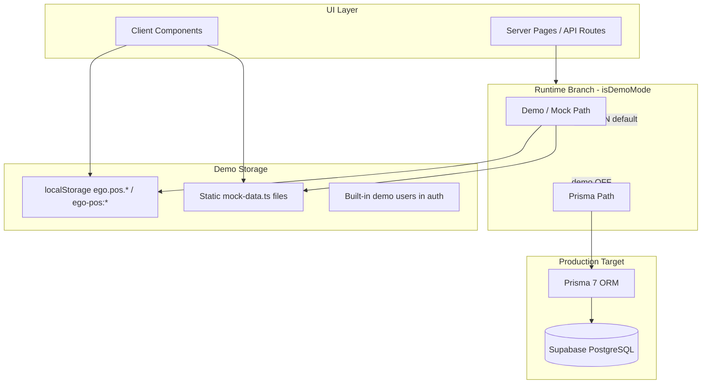
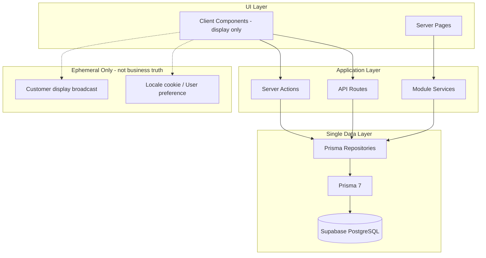
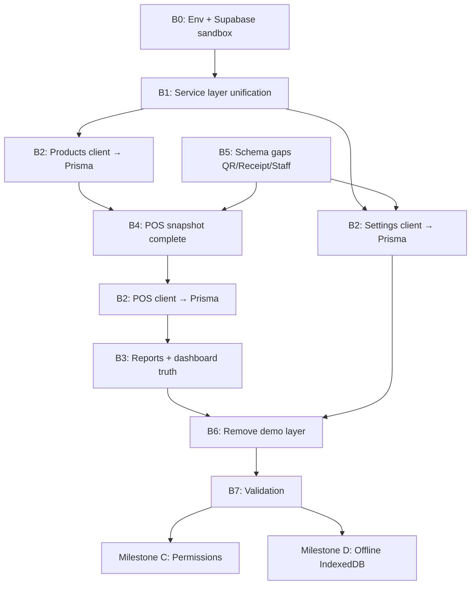

# Milestone B — Database Foundation Plan

**Date:** 21 June 2026  
**Status:** Plan only — **no implementation in this milestone pass**  
**Authority:** `MASTER_SPECIFICATION.md`, audit reports, confirmed Go BOX pilot criteria  
**Prerequisite:** Milestone A Production Build Recovery — **GO** (build passes in production mode)

---

## Executive Summary

EGO POS runs on a **dual data architecture**: browser `localStorage` demo repositories and static mock files on one side, Prisma/PostgreSQL (Supabase target) on the other. Server `*-service.ts` files branch on `isDemoMode()`; many **client components bypass services entirely** and write to `localStorage` unconditionally.

Milestone B removes this split and establishes **Supabase PostgreSQL as the single source of truth** for all merchant modules, while preserving demo/mock code only as **seed input** (not runtime paths).

---

## Database Foundation GO / NO-GO

| Decision | Verdict |
|----------|---------|
| **Start Milestone B (plan → implement)** | **GO** |
| **Current database foundation state** | **NO-GO** |

**GO to start** because: Milestone A build passes; Prisma schema (66 models) is production-capable; Supabase connection path exists; `prisma/seed-demo.ts` can bootstrap Go BOX data; tenant write helpers (`withTenantTransaction`) exist.

**NO-GO today** because: 35+ files import `@/lib/demo`; POS/products UI ignore Prisma in practice; reports hub is 100% mock; demo mode defaults ON; three conflicting demo flag checks remain.

---

## 1. Current State

### 1.1 Architecture pattern today

### 1.2 Demo mode controls (inconsistent)

| Check | Location | Semantics |
|-------|----------|-----------|
| `isDemoMode()` | `lib/demo-mode.ts` | `true` unless `IGO_DEMO_MODE === "false"` (**default ON**) |
| `demoMode` prop | `app/(dashboard)/layout.tsx`, `pos/page.tsx` | `true` only if `IGO_DEMO_MODE === "true"` |
| Fake session | `lib/auth/session.ts` | Demo user if `IGO_DEMO_MODE === "true"` |
| Write guard | `lib/db/write-context.ts` | Throws if demo ON |
| Permission bypass | `lib/auth/permissions.ts` | Skips checks if demo ON |

### 1.3 localStorage data sources (27 keys)

**Primary keys** (`lib/demo/storage-keys.ts` → `DemoStorageKeys`):

| Key | Domain | Prisma target tables |
|-----|--------|----------------------|
| `ego.pos.products` | Product catalog | `Product`, `ProductUnit`, `ProductImage` |
| `ego.pos.categories` | Categories | `Category` |
| `ego.pos.customers` | Customers | `Customer`, `CustomerGroup` |
| `ego.pos.memberships` | Membership records | `MembershipLevel`, `CustomerSubscription` |
| `ego.pos.promotions` | Promotions | `Promotion`, rules/actions |
| `ego.pos.sales` | POS sales | `Sale`, `SaleItem`, `SalePayment` |
| `ego.pos.receipts` | Receipt snapshots | `Receipt` (schema TBD / snapshot field) |
| `ego.pos.auditLogs` | Audit | `AuditLog` |
| `ego.pos.pendingApprovals` | Approvals | `Approval` |
| `ego.pos.inventory.movements` | Stock movements | `StockMovement`, `InventoryBalance` |
| `ego.pos.settings` | Company settings | `CompanySetting` |
| `ego.pos.qr.banks` | QR banks | `Bank` / settings JSON (schema gap) |
| `ego.pos.qr.accounts` | QR accounts | `QrAccount` (schema gap) |
| `ego.pos.staff.access.users` | Staff | `User`, `CompanyUser`, `UserRole` |
| `ego.pos.staff.access.audit` | Staff audit | `AuditLog`, `LoginHistory` |
| `ego.pos.customerDisplay.state` | Customer display | Ephemeral / broadcast (not DB) |
| `ego.pos.customerDisplay.settings` | Display settings | `CompanySetting` |
| `ego-pos:onboarding-*` (4 keys) | Onboarding | `Company`, `Branch`, `Warehouse` |
| `ego-pos:locale`, `theme`, `plan-*`, `company-logo-url` | UI prefs | `CompanySetting`, `User` prefs |

**Legacy key aliases** migrated via `LegacyStorageKeys` in same file.

**Infrastructure:** `lib/demo/storage.ts` — read/write/migrate all localStorage access.

### 1.4 Mock repositories (`lib/demo/repositories.ts`)

| Repository | Storage key | Used by |
|------------|-------------|---------|
| `demoProductsRepository` | products | Products UI, POS client |
| `demoCategoryRepository` | categories | Products UI, product form |
| `demoInventoryMovementRepository` | inventory.movements | POS (partial) |
| `demoSalesRepository` | sales | POS client checkout |
| `demoReceiptsRepository` | receipts | POS client |
| `demoAuditLogRepository` | auditLogs | POS client |
| `demoPendingApprovalRepository` | pendingApprovals | POS client |
| `demoStaffRepository` | staff.access.users | Settings form |
| `demoSettingsRepository` | settings, logo, plan | Settings, dashboard shell |
| `demoQrRepository` | qr.banks, qr.accounts | Settings, POS |
| `demoCustomerRepository` | customers | (factory) |
| `demoMembershipRepository` | memberships | (factory) |
| `demoPromotionRepository` | promotions | (factory) |

### 1.5 Static mock data files (9 files)

| File | Purpose | Consumed by |
|------|---------|-------------|
| `features/products/mock-data.ts` | Products, categories, images | `product-service.ts` (demo branch) |
| `features/inventory/mock-data.ts` | Warehouses, items, movements | `inventory-service.ts`, purchasing |
| `features/customers/mock-data.ts` | Customers, levels, payments | `customer-service.ts`, promotions |
| `features/suppliers/mock-data.ts` | Suppliers, POs, payments | `supplier-service.ts`, reports |
| `features/purchasing/mock-data.ts` | POs, payables | `purchasing-service.ts` |
| `features/promotions/mock-data.ts` | Promotions | `promotion-service.ts` |
| `features/pos/mock-data.ts` | POS products/customers/QR | **Orphaned** — not wired via `pos-service.ts` |
| `features/reports/mock-data.ts` | Report metrics | `report-service.ts` (demo branch) |
| `features/reports/mock-full-data.ts` | **Fake analytics hub** | `reports-analytics-client.tsx` **always** |

### 1.6 Demo-only / split services (`*-service.ts`)

| Service | Demo path | Prisma path | Client bypass? |
|---------|-----------|-------------|----------------|
| `product-service.ts` | `mock-data.ts` | `prisma-repository.ts` | **Yes** — UI uses `demoProductsRepository` always |
| `inventory-service.ts` | `mock-data.ts` | `prisma-repository.ts` (reads) | Writes always Prisma via `actions.ts` |
| `customer-service.ts` | `mock-data.ts` | `prisma-repository.ts` | Partial via API |
| `supplier-service.ts` | `mock-data.ts` | `prisma-repository.ts` | Partial via API |
| `purchasing-service.ts` | `mock-data.ts` | `prisma-repository.ts` | Partial via API |
| `promotion-service.ts` | `mock-data.ts` + simulation | `prisma-repository.ts` | Partial via API |
| `report-service.ts` | `mock-data.ts` | `prisma-repository.ts` (partial) | **Yes** — hub uses `mock-full-data.ts` |
| `dashboard-service.ts` | `emptySnapshot()` | `getPrismaDashboardSnapshot()` | No |
| `pos-service.ts` | Empty snapshot + client LS | `getPrismaPosSnapshot()` (partial) | **Yes** — POS client uses demo repos when `demoMode` |
| `membership-level-service.ts` | None | Prisma only | No |
| `platform/onboarding-context.ts` | localStorage only | None | **Yes** — 100% client storage |

### 1.7 Prisma repositories (production write path exists)

| Module | Repository | API routes | Server actions |
|--------|------------|------------|----------------|
| Products | ✅ | ✅ | ✅ |
| Inventory | ✅ | ✅ | ✅ |
| Customers | ✅ | ✅ | ✅ |
| Suppliers | ✅ | ✅ | ✅ |
| Purchasing | ✅ | ✅ | ✅ |
| Promotions | ✅ | ✅ | ✅ |
| POS / Sales | ✅ | ✅ | ✅ |
| Reports | ⚠️ Partial (profit DTO broken) | ✅ | — |
| Settings | ⚠️ Partial | ✅ | ✅ |
| Membership levels | ✅ | ✅ | ✅ |

### 1.8 Fake report calculations

| Location | Issue |
|----------|-------|
| `features/reports/mock-full-data.ts` | Entire analytics hub: KPIs, trends, health score, hourly sales |
| `features/reports/components/reports-analytics-client.tsx` | Imports mock-full-data **unconditionally** |
| `features/reports/dto-mapper.ts` | `totalProfit: 0`, `categoryBreakdown: []` hardcoded |
| `features/reports/prisma-repository.ts` | Sales metrics = single "All time" row |
| `features/dashboard/dashboard-service.ts` | Demo mode returns `emptySnapshot()` (zeros) |
| `features/promotions/promotion-service.ts` | `simulatePromotion()` mock-only rich simulation |

### 1.9 Seeds (migration source of truth)

| Script | Purpose |
|--------|---------|
| `prisma/seed.ts` | Foundation: super admin, permissions, Go BOX company skeleton |
| `prisma/seed-demo.ts` | Full demo dataset from mock-data into Supabase |

**Target:** Run `seed-demo.ts` against Supabase sandbox; retire runtime mock reads.

---

## 2. Target State

### 2.1 Single-source-of-truth architecture

### 2.2 Principles (from Master Spec)

1. **One repository interface per module** — no `isDemoMode()` branch in services
2. **Client components never write business data to localStorage**
3. **All reads/writes go through Prisma** with tenant scope
4. **Mock files become seed input only** — deleted from runtime imports
5. **`IGO_DEMO_MODE` removed** or limited to local dev tooling only (not production)
6. **Supabase PostgreSQL** — single production database per environment
7. **Offline layer (Milestone D)** will use IndexedDB outbox — **not** localStorage demo repos

### 2.3 Environment model

| Environment | Database | Demo localStorage |
|-------------|----------|-------------------|
| Local dev | Supabase dev project or local Postgres | Optional dev UI flag (deprecated) |
| Sandbox / QA | Supabase staging | **Disabled** |
| Production (Go BOX) | Supabase production | **Disabled** |

---

## 3. Data Flow Map

### 3.1 Module migration flows

| Module | Current read | Current write | Target read | Target write |
|--------|--------------|---------------|-------------|--------------|
| **Auth** | NextAuth + demo users + Prisma | Settings demo staff | Prisma `User`, `CompanyUser` | Prisma + audit |
| **Onboarding** | localStorage | localStorage | Prisma `Company`, `Branch`, `Warehouse` | Server action |
| **Products** | Client LS + mock service | Client LS | `product-service` → Prisma | `products/actions` |
| **POS** | Client LS + partial Prisma snapshot | Client LS OR `completePrismaSale` | `pos-service` → Prisma | `pos/actions` only |
| **Inventory** | Mock service (demo) / Prisma (prod) | Prisma actions always | Prisma only | `inventory/actions` |
| **Customers** | Mock service / Prisma API | Prisma API | Prisma only | `customers/actions` |
| **Membership** | Prisma (admin) / empty (POS) | Prisma API | Prisma + POS snapshot | Prisma |
| **Promotions** | Mock / Prisma | Prisma API | Prisma only | `promotions/actions` |
| **Purchasing** | Mock / Prisma | Prisma API | Prisma only | `purchasing/actions` |
| **Suppliers** | Mock / Prisma | Prisma API | Prisma only | `suppliers/actions` |
| **Reports** | mock-full-data / partial Prisma | N/A | Shared `reports/prisma-repository` | N/A |
| **Dashboard** | empty (demo) / Prisma | N/A | Same as reports aggregates | N/A |
| **Settings** | demoSettingsRepository | demo + partial Prisma | `settings/prisma-repository` | `settings/actions` |
| **Audit** | demoAuditLogRepository | demo OR `withTenantTransaction` | `AuditLog` table only | All writes |

### 3.2 Critical path (Go BOX pilot data)

```mermaid
flowchart LR
    A[B0: Runtime mode + env] --> B[B1: Seed Supabase Go BOX]
    B --> C[B2: Auth + tenant session]
    C --> D[B3: Products → Prisma]
    D --> E[B4: Inventory balances]
    E --> F[B5: POS snapshot + checkout]
    F --> G[B6: Reports + dashboard aggregates]
    G --> H[B7: Settings + QR banks]
    H --> I[B8: Remove demo layer]
```

---

## 4. Migration Plan: Demo → Prisma → Supabase

### Phase B0 — Foundation gates (Week 1)

| Task | Action |
|------|--------|
| B0.1 | Introduce `getRuntimeMode()` replacing all demo checks |
| B0.2 | Set production default: demo OFF; document Vercel env vars |
| B0.3 | Add CI check: fail build if `@/lib/demo/repositories` imported from client components |
| B0.4 | Provision Supabase sandbox; run migrations + `seed-demo.ts` |
| B0.5 | Verify tenant IDs in seed match session (`gobox-company`, etc.) |

**Exit criteria:** Sandbox DB populated; single env contract documented.

### Phase B1 — Repository unification (Week 1–2)

| Task | Action |
|------|--------|
| B1.1 | Define `RepositoryPort` interface per module (read existing DTOs) |
| B1.2 | Rename `prisma-repository.ts` → canonical implementation |
| B1.3 | Remove `isDemoMode()` branches from all `*-service.ts` files |
| B1.4 | Services always call Prisma repos with `tenantFromSession` |

**Exit criteria:** No `isDemoMode()` in `features/*/` services except deprecated shim (0 imports).

### Phase B2 — Client component decoupling (Week 2–3)

| Priority | Component | Change |
|----------|-----------|--------|
| P0 | `product-list-client.tsx`, `product-form.tsx`, `product-edit-client.tsx` | Replace demo repo calls with server actions / API |
| P0 | `pos-page-client.tsx` | Remove demo repo checkout path; always `completeSaleAction` |
| P0 | `reports-analytics-client.tsx` | Accept server snapshot prop; delete mock-full-data import |
| P1 | `settings-form.tsx` | Persist via `settings/actions` + Prisma only |
| P1 | `onboarding-context.ts` | Server persistence for company setup |
| P2 | Locale/theme | Move to cookie or `User`/`CompanySetting` (not demo keys) |

**Exit criteria:** Zero `@/lib/demo/repositories` imports in `features/**/components`.

### Phase B3 — Reports & dashboard truth (Week 3)

| Task | Action |
|------|--------|
| B3.1 | Wire `/reports` page to `getReportsSnapshot()` server-side |
| B3.2 | Fix `dto-mapper.ts` profit + category breakdown |
| B3.3 | Implement period grouping in `reports/prisma-repository.ts` |
| B3.4 | Dashboard reads same aggregate queries as reports |

**Exit criteria:** 5 financially accurate reports from Supabase (per pilot criteria).

### Phase B4 — POS snapshot completion (Week 3–4)

| Task | Action |
|------|--------|
| B4.1 | Load customers, QR banks, promotions in `getPosSnapshot()` from Prisma |
| B4.2 | Remove empty-array overrides in `pos-service.ts` |
| B4.3 | Customer display: BroadcastChannel or SSE (keep ephemeral state out of DB) |

**Exit criteria:** Production POS loads full snapshot from Supabase without localStorage.

### Phase B5 — Schema gaps (Week 4)

| Gap | Action |
|-----|--------|
| `Bank`, `QrAccount` | Add to Prisma or store in `CompanySetting` JSON with typed DTO |
| `Receipt` snapshot | Confirm schema; wire POS receipt write |
| `CompanyModule` | Add or defer in spec |
| Staff branch assignment | `CompanyUser.branchId` or `UserBranch` |

**Exit criteria:** Settings QR/staff persist to Supabase and load in POS.

### Phase B6 — Demo layer removal (Week 4–5)

| Task | Action |
|------|--------|
| B6.1 | Delete or quarantine `lib/demo/repositories.ts`, `lib/demo/storage.ts` |
| B6.2 | Keep `mock-data.ts` files for `seed-demo.ts` only |
| B6.3 | Remove `lib/demo-mode.ts` from production paths |
| B6.4 | Update `DATA_SOURCE_MAP.md` + `SYSTEM_INTEGRATION_MAP.md` |

**Exit criteria:** Grep shows zero runtime localStorage business writes.

### Phase B7 — Validation (Week 5)

| Test | Method |
|------|--------|
| Product CRUD | API + UI against Supabase |
| POS sale | Stock deduction + sale rows in DB |
| Reports | Compare totals to raw SQL |
| Settings round-trip | QR banks appear in POS |
| Multi-tenant isolation | company_id filter audit |

---

## 5. Risk Analysis

| ID | Risk | Severity | Mitigation |
|----|------|----------|------------|
| R1 | **Data loss** when disabling localStorage — users have browser-only demo data | High | Export script before cutover; seed Supabase first; parallel run period |
| R2 | **POS checkout regression** — demo path is primary today | Critical | Migrate POS last within B2; feature flag `USE_PRISMA_CHECKOUT` during QA |
| R3 | **Schema gaps** (QR banks, receipts) block settings migration | High | B5 before settings cutover; JSON fallback in `CompanySetting` short-term |
| R4 | **Seed ID mismatch** — demo session uses hardcoded `gobox-*` IDs | High | Align `seed-demo.ts` with auth session company/branch IDs |
| R5 | **Inventory read/write split** causes wrong stock display | High | B1 unifies service; inventory reads from Prisma balances only |
| R6 | **Reports profit still zero** after hub wiring | High | Fix dto-mapper in B3 before pilot gate |
| R7 | **Removing demo mode breaks local dev** for designers | Medium | Keep `seed-demo.ts` + sandbox URL; optional `DEV_USE_MOCK_UI` dev-only |
| R8 | **Offline requirement conflicts** with localStorage removal | Medium | Milestone D adds IndexedDB outbox — do not reintroduce demo LS as offline |
| R9 | **Supabase connection pooling** on Vercel | Medium | Use pooler URL; lazy Prisma init (Milestone A pattern) |
| R10 | **Large refactor scope** — 35+ demo imports | Medium | Strict phase order; CI import guards per phase |

---

## 6. Dependency Graph

**Hard dependencies:**
- POS client migration **depends on** products + customers + settings in Supabase
- Reports **depends on** sales/inventory data in Supabase
- Demo layer removal **depends on** all client migrations complete
- Permissions milestone (C) **should follow** B7 (data truth first)

---

## 7. Priority Order

| Order | Phase | Rationale | Resolves |
|------:|-------|-----------|----------|
| 1 | **B0** — Env + Supabase sandbox | Without DB, nothing to migrate to | CRIT-003, deployment |
| 2 | **B1** — Remove service-layer demo branches | Stops dual-path server logic | CRIT-014, integration map |
| 3 | **B2-P0** — Products UI → Prisma | POS depends on product catalog | CRIT-004 partial, INT-01 |
| 4 | **B5** — Schema gaps (QR, staff branch) | Blocks settings + POS QR | Settings propagation |
| 5 | **B4** — POS snapshot from Prisma | Unblocks membership/QR at checkout | CRIT-004 |
| 6 | **B2-P0** — POS checkout via actions only | Single sale write path | CRIT-007 partial |
| 7 | **B3** — Reports + dashboard | Pilot financial accuracy gate | CRIT-005, CRIT-006 |
| 8 | **B2-P1** — Settings + onboarding → Prisma | Company truth | CRIT-008 partial |
| 9 | **B2-P2** — Locale/theme off demo keys | i18n persistence | LOC-06 |
| 10 | **B6** — Delete demo runtime layer | Completes migration | CRIT-003 |
| 11 | **B7** — Validation + docs | Sign-off | Pilot data gate |

---

## 8. Files in Scope (implementation reference)

### Delete / quarantine after B6

- `lib/demo/repositories.ts`
- `lib/demo/storage.ts`
- `lib/demo/storage-keys.ts` (keep keys doc for migration script only)
- `lib/demo-mode.ts` (production)

### Keep as seed-only

- `features/*/mock-data.ts` (9 files)
- `prisma/seed-demo.ts`

### Refactor (high touch)

- `features/products/components/product-*.tsx` (3 files)
- `features/pos/components/pos-page-client.tsx`
- `features/reports/components/reports-analytics-client.tsx`
- `features/settings/components/settings-form.tsx`
- `features/platform/onboarding-context.ts`
- All `features/*/*-service.ts` (10 files)

---

## 9. Success Criteria (Milestone B complete)

| # | Criterion | Verification |
|---|-----------|--------------|
| 1 | Zero business data in localStorage at runtime | Grep + browser audit |
| 2 | All `*-service.ts` call Prisma only | No `isDemoMode()` in services |
| 3 | Supabase is sole database for merchant modules | Env + integration test |
| 4 | Products, POS, reports read same Supabase data | Cross-module consistency test |
| 5 | `seed-demo.ts` reproduces Go BOX sandbox | Fresh DB seed + smoke test |
| 6 | Demo repositories deleted from production bundle | Bundle analyze / grep |
| 7 | CRIT-003, CRIT-004, CRIT-005, CRIT-006, CRIT-014 addressed | Re-audit |

---

## 10. Out of Scope (Milestone B)

Per user directive and audit sequencing:

- Permission enforcement changes (Milestone C)
- Approval workflow implementation
- Offline / IndexedDB architecture (Milestone D)
- Promotion checkout engine completion
- PIN override
- Super Admin SaaS billing

---

## 11. Estimated Effort

| Phase | Duration |
|-------|----------|
| B0–B1 | 1 week |
| B2 | 2 weeks |
| B3–B4 | 1 week |
| B5 | 1 week |
| B6–B7 | 1 week |
| **Total** | **~5–6 weeks** |

---

## 12. Decision Summary

| Question | Answer |
|----------|--------|
| Proceed with Milestone B implementation? | **GO** |
| Is database foundation production-ready today? | **NO-GO** |
| Blockers before B0 starts? | None — Milestone A complete |
| First implementation task? | **B0.1 + B0.4** — unified runtime mode + Supabase sandbox seed |

---

*Plan only. No code was modified. Awaiting approval to begin B0 implementation.*
