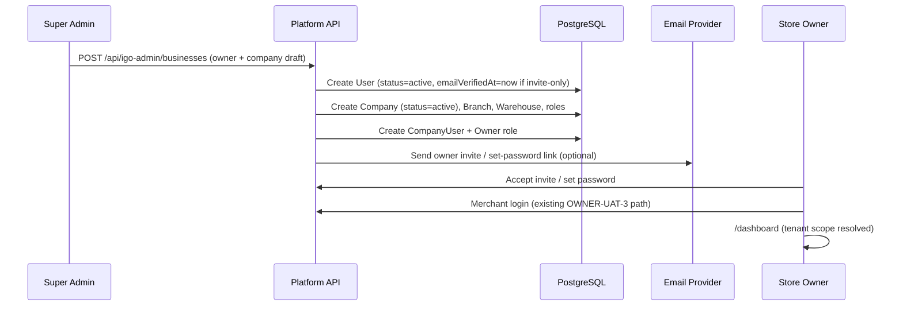
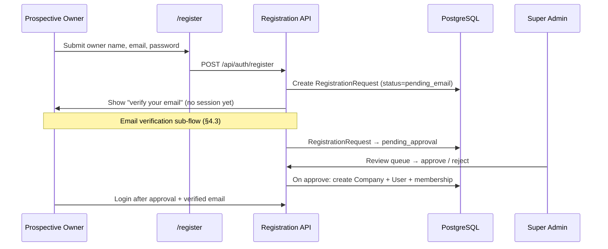

# OWNER-UAT-5 — Register & Email Verification Planning Spec

> **Phase:** OWNER-UAT-5 (planning only)  
> **Baseline:** GitHub `main` @ `2f9f1ea` (OWNER-UAT-4 language hardening)  
> **Status:** Design document — **no live email sending, no auth changes, no registration API implemented**

---

## 1. Purpose

Define the future owner registration, email verification, and Super Admin approval model for EGO POS without implementing it during Owner UAT. Preserve current merchant login/session behavior from OWNER-UAT-3 and language behavior from OWNER-UAT-4.

---

## 2. Current register behavior (audit)

### 2.1 Login page entry point

| Item | Current behavior |
| --- | --- |
| **Location** | `components/auth/login-form.tsx` |
| **Label** | Dictionary key `registerNewAccount` (EN: "Register New Account", LO: "ສະໝັກບັນຊີໃໝ່") |
| **Action** | `<Link href="/register">` — navigation only, no auth side effects |
| **Auth impact** | None — does not create users, sessions, or companies |

### 2.2 `/register` page

| Item | Current behavior |
| --- | --- |
| **Location** | `app/(auth)/register/page.tsx` |
| **Form fields** | Owner name, email, password (HTML `required` only) |
| **Submit** | **No submit handler** — primary CTA is `<Link href="/businesses">` labeled "Continue" |
| **Persistence** | **None** — form values are discarded |
| **API** | **No** `POST /api/auth/register` or equivalent |
| **Email verification** | **Not implemented** |
| **Access control** | Page is public (no session required) |

**Risk today:** UI implies self-signup is available, but the flow is a dead-end shell that jumps to `/businesses`, which itself requires an authenticated session (`requireSession()` → redirect to `/login`).

### 2.3 Post-register onboarding (`/businesses`)

| Step | Route | Current behavior |
| --- | --- | --- |
| Template picker | `/businesses` | Requires logged-in merchant session |
| Business setup | `/businesses/setup?template=…` | Client-only draft in `localStorage` |
| Completion | `completeOnboarding()` in `features/platform/onboarding-context.ts` | Writes onboarding context to `localStorage` only — **no `Company` / `Branch` / `User` DB rows** |
| Entry after login | `getStoredEntryPath()` | Returns `/dashboard` if local onboarding complete, else `/businesses` |

### 2.4 Super Admin store creation (today)

| Item | Current behavior |
| --- | --- |
| **Super Admin auth** | Separate session at `/igo-admin/login` via `POST /api/igo-admin/login` |
| **Business list** | `/igo-admin/businesses` — read-only table from `getAdminBusinesses()` |
| **Create store UI** | **Not implemented** — suspend/activate/delete/restore buttons are disabled placeholders |
| **DB seed path** | Real stores created via `prisma/seed-demo.ts` / `prisma/seed.ts` (e.g. `gobox-company`, owner `igo-admin`) |
| **Company lifecycle** | `Company.status` enum: `active`, `suspended`, `disabled`, `deleted` — no `pending_approval` state |

### 2.5 Relevant existing schema (no verification models)

- `User` — `email`, `username`, `passwordHash`, `pinHash`, `status`, `preferredLocale`; **no `emailVerifiedAt`**
- `Company` — `ownerUserId`, `status`, `planId`; **no registration source / approval metadata**
- `SuperAdmin` — platform operators only; separate from merchant `User`
- `LoginHistory` — success/failed merchant logins only
- **Missing:** email verification tokens, registration requests, platform settings for self-registration toggle

### 2.6 Documented blockers (already tracked)

- `PRODUCTION_BLOCKER_REPORT.md` — no owner registration endpoint; `/register` is static
- `OWNER_UAT_RUNBOOK.md` — SaaS onboarding / self-signup not production-ready
- `PROJECT_CURRENT_STATE_SUMMARY.md` — registration ~15% (localStorage UI only)

---

## 3. Confirmed product requirements (future)

1. **Public registration is not open during UAT** — current shell remains; no live signup.
2. **Super Admin creates stores manually** — primary production path for new tenants until self-registration is enabled.
3. **Future optional self-registration** — gated by Super Admin platform setting; submissions enter **pending approval**.
4. **Email verification required** before a self-registered owner can activate/login (future).
5. **Email provider not selected yet** — design must be provider-agnostic.

---

## 4. Desired future flows

### 4.1 Super Admin–created store flow (recommended first implementation)



**Notes:**

- Super Admin–provisioned owners may skip public registration entirely.
- Email can be **invite link** (password set) rather than self-signup verification — still uses same mail infrastructure later.
- All tenant rows created server-side in one transaction; no `localStorage` onboarding as source of truth.

### 4.2 Self-registration request flow (future, feature-flagged)



**Gating:**

- Platform setting: `selfRegistrationEnabled = false` (default).
- When `false`: `/register` shows informational message + link to contact Super Admin; no API acceptance.
- When `true`: API accepts requests but company remains **inactive** until Super Admin approval.

### 4.3 Email verification flow (future)

```mermaid
sequenceDiagram
  participant User as Owner
  participant API as Auth API
  participant DB as PostgreSQL
  participant Mail as Email Provider

  User->>API: POST /api/auth/register
  API->>DB: Store EmailVerificationToken (hashed, expires)
  API->>Mail: Send verification email (link or OTP)
  User->>API: GET /api/auth/verify-email?token=…
  API->>DB: Mark token used; set User.emailVerifiedAt or request.verifiedAt
  API->>User: Redirect to "pending approval" or login
```

**Rules:**

- Verification tokens: single-use, hashed at rest, TTL 24–72 hours.
- Unverified accounts cannot obtain merchant session JWT.
- Resend endpoint rate-limited; does not reveal whether email exists.
- Changing email resets verification state.

### 4.4 Super Admin approval flow (future)

| State | Owner can login? | Company active? | Visible in POS? |
| --- | --- | --- | --- |
| `pending_email` | No | No | No |
| `pending_approval` | No (or limited "status" page only) | No | No |
| `rejected` | No | No | No |
| `approved` + verified email | Yes | Yes | Yes |
| `suspended` | No | No (existing) | No |

**Super Admin actions:**

- `GET /api/igo-admin/registration-requests?status=pending_approval`
- `POST /api/igo-admin/registration-requests/{id}/approve` — provisions tenant (same as manual create)
- `POST /api/igo-admin/registration-requests/{id}/reject` — optional reason, audit log
- Existing business suspend/activate remains on `Company.status`

---

## 5. Required database models (proposed)

### 5.1 Extend existing models

| Model | Proposed fields |
| --- | --- |
| `User` | `emailVerifiedAt DateTime?`, `registrationSource enum (seed, super_admin, self_service)` |
| `Company` | `registrationSource`, `approvedAt`, `approvedBySuperAdminId`, `rejectionReason` |
| `CompanyStatus` (enum) | Add `pending_approval` (or separate `RegistrationRequest` to avoid enum migration risk) |

### 5.2 New models

```prisma
model PlatformSetting {
  id                      String   @id @default("default")
  selfRegistrationEnabled Boolean  @default(false)
  requireEmailVerification Boolean @default(true)
  updatedAt               DateTime @updatedAt
}

model RegistrationRequest {
  id              String   @id @default(cuid())
  ownerName       String
  email           String
  passwordHash    String   // set at submit; or defer until approval
  status          RegistrationRequestStatus
  emailVerifiedAt DateTime?
  reviewedAt      DateTime?
  reviewedById    String?  // SuperAdmin
  rejectionReason String?
  companyId       String?  // set on approval
  userId          String?  // set on approval
  createdAt       DateTime @default(now())
  @@unique([email, status]) // partial unique for active pending — enforce in app
  @@index([status, createdAt])
}

enum RegistrationRequestStatus {
  pending_email
  pending_approval
  approved
  rejected
  expired
}

model EmailVerificationToken {
  id        String   @id @default(cuid())
  email     String
  tokenHash String
  purpose   String   // register, change_email, invite
  requestId String?
  userId    String?
  expiresAt DateTime
  usedAt    DateTime?
  createdAt DateTime @default(now())
  @@index([email, purpose])
}
```

### 5.3 Audit

- Extend `CompanyAccessLog` or add `RegistrationAuditLog` for approve/reject/invite events (actor, IP, timestamp).

---

## 6. Required API routes (proposed)

### 6.1 Public (future, rate-limited)

| Method | Route | Purpose |
| --- | --- | --- |
| `POST` | `/api/auth/register` | Create registration request + send verification email |
| `GET` | `/api/auth/verify-email` | Consume verification token |
| `POST` | `/api/auth/resend-verification` | Resend verification (generic response) |
| `GET` | `/api/auth/registration-status` | Poll request status (token-based, no enumeration) |

### 6.2 Super Admin (future)

| Method | Route | Purpose |
| --- | --- | --- |
| `POST` | `/api/igo-admin/businesses` | Manual store + owner provisioning |
| `POST` | `/api/igo-admin/businesses/{id}/invite-owner` | Resend owner invite email |
| `GET` | `/api/igo-admin/registration-requests` | Approval queue |
| `POST` | `/api/igo-admin/registration-requests/{id}/approve` | Provision tenant |
| `POST` | `/api/igo-admin/registration-requests/{id}/reject` | Reject with reason |
| `PATCH` | `/api/igo-admin/platform-settings` | Toggle `selfRegistrationEnabled` |

### 6.3 Unchanged during UAT

- `POST /api/auth/callback/credentials` — merchant login (OWNER-UAT-3)
- `GET/POST` locale cookie / `LanguageToggle` — OWNER-UAT-4
- No new routes added in UAT-5 planning phase

---

## 7. Email provider options (not selected)

| Provider | Pros | Cons | Fit for EGO POS |
| --- | --- | --- | --- |
| **Resend** | Simple API, good DX, React email templates | Newer vendor; Laos deliverability unverified | Strong candidate for MVP |
| **SendGrid** | Mature, analytics, high volume | Setup complexity, cost at scale | Enterprise option |
| **Amazon SES** | Low cost, scalable | AWS coupling, sandbox/warm-up | Good if already on AWS |
| **Postmark** | Excellent deliverability | Higher cost per email | Transactional-focused |
| **Mailgun** | Flexible API | Deliverability varies by region | Alternative |
| **SMTP (self-hosted)** | Full control | Ops burden, spam reputation risk | Not recommended for SaaS MVP |

**Recommendation:** Abstract behind `lib/email/email-service.ts` with interface `sendVerificationEmail`, `sendOwnerInvite`, `sendApprovalNotice`. Choose provider in a dedicated infra phase after Laos deliverability test. Store `EMAIL_PROVIDER`, API keys in env only — never in repo.

**Email types to template:**

1. Verify email (self-registration)
2. Owner invite / set password (Super Admin created)
3. Registration approved — you can log in
4. Registration rejected (optional reason)
5. Password reset (future, separate from UAT-5)

---

## 8. Security risks

| Risk | Impact | Mitigation |
| --- | --- | --- |
| Fake signups / spam tenants | DB noise, admin fatigue | `selfRegistrationEnabled` default off; CAPTCHA; rate limits; email verification |
| Email enumeration | Privacy leak | Generic responses on register/resend/login |
| Token leakage in URL | Account takeover | Short TTL, single-use hashed tokens, HTTPS only |
| Unapproved tenant access | Cross-tenant data risk | Block session creation until `approved` + `emailVerifiedAt`; reuse tenant-scope guards |
| Weak passwords on register | Credential stuffing | bcrypt cost ≥12; optional password policy; breach list check later |
| Super Admin invite link replay | Unauthorized owner access | One-time invite tokens; audit log |
| `/register` → `/businesses` bypass confusion | User frustration, false sense of signup | Until implemented: disable CTA or show "coming soon" (UI change — post-UAT) |
| localStorage onboarding as tenant truth | Split-brain vs DB | Deprecate for production; DB provisioning only |

---

## 9. Abuse / spam prevention

1. **Rate limiting** — per IP and per email: register (3/hour), resend (1/15min), verify attempts (10/hour).
2. **CAPTCHA** — hCaptcha or Cloudflare Turnstile on `/register` when self-registration enabled.
3. **Email domain controls** — optional blocklist/disposable-email detection.
4. **Manual approval queue** — Super Admin must approve all self-registrations even after email verify.
5. **Honeypot field** — silent reject on filled hidden fields.
6. **Audit trail** — log registration IP, user-agent, approval actor.
7. **No open relay** — all sends via authenticated provider API; no user-supplied SMTP.

---

## 10. Recommended implementation phases

| Phase | Scope | Depends on | Out of UAT? |
| --- | --- | --- | --- |
| **R1 — Planning** | This document; issue log note | — | **UAT-5 (now)** |
| **R2 — Super Admin manual provisioning** | `POST /api/igo-admin/businesses`, DB transaction for Company/Branch/User/roles; wire disabled admin buttons | Super Admin phase | Yes |
| **R3 — Email abstraction** | `EmailService` interface, env config, dev sink (console/log) | Provider choice | Yes |
| **R4 — Owner invite email** | Invite token + set-password for SA-created stores | R2, R3 | Yes |
| **R5 — Registration request API** | `RegistrationRequest` model, `POST /api/auth/register`, pending states | R3 | Yes |
| **R6 — Email verification** | Tokens, verify/resend endpoints, block login until verified | R5 | Yes |
| **R7 — Approval queue UI** | Super Admin review approve/reject | R5 | Yes |
| **R8 — Self-registration gate** | `PlatformSetting.selfRegistrationEnabled`, update `/register` UX | R6, R7 | Yes |
| **R9 — Retire localStorage onboarding** | `/businesses` writes to DB; migration for demo path | R2 | Yes |
| **R10 — Hardening** | Rate limits, CAPTCHA, harnesses, penetration checklist | R8 | Yes |

**Do not implement R2–R10 during Owner UAT** unless explicitly scheduled as a new phase.

---

## 11. UAT-5 planning acceptance

| Check | Result |
| --- | --- |
| Current `/register` audited | Yes — static shell, no API |
| Current onboarding audited | Yes — localStorage only, session required for `/businesses` |
| Future flows documented | Yes |
| DB / API / email / security / phases documented | Yes |
| No auth or email provider code changed | Yes — planning only |
| OWNER-UAT-3 / OWNER-UAT-4 preserved | Yes — no code changes |

---

## 12. References

- `app/(auth)/register/page.tsx`
- `components/auth/login-form.tsx`
- `features/platform/onboarding-context.ts`
- `app/(platform)/businesses/page.tsx`
- `app/(igo-admin)/igo-admin/businesses/page.tsx`
- `prisma/schema.prisma` — `User`, `Company`, `SuperAdmin`
- `PRODUCTION_BLOCKER_REPORT.md`
- `OWNER_UAT_RUNBOOK.md`
