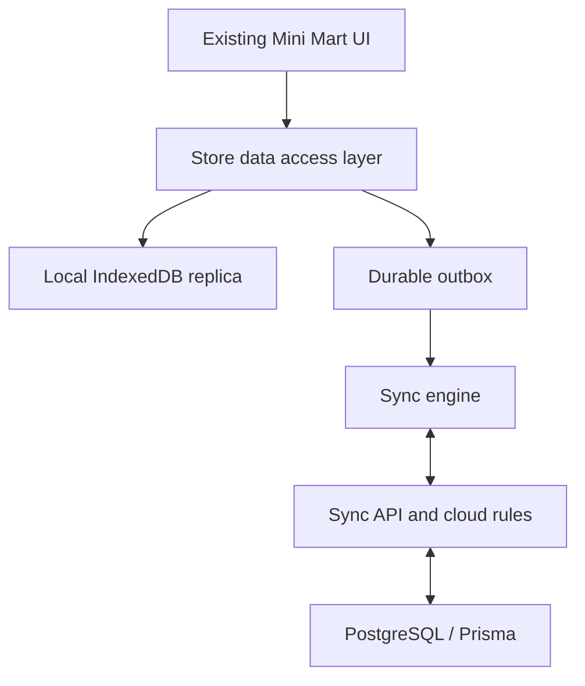

# EGO POS Mini Mart — Offline-First Requirements

## 1. Purpose and decision

EGO POS Mini Mart must become one application that continues to operate when its internet connection is unavailable. It must automatically use the local device data and queue changes while offline, then synchronize safely with the existing cloud system when a connection returns.

This is **not** a separate offline application, a second product database, or a demo mode. The online cloud database remains the business-wide source of record; the local device database is an encrypted operational replica and a durable queue for one POS terminal/device.

The target is to make the Mini Mart experience functionally equivalent online and offline for normal store work, while visibly applying limited safety rules where a live cloud confirmation is inherently required.

## 2. Fixed scope

### Included: Mini Mart store application

- POS checkout, barcode/search, units, cart, discount, tax, receipt, QR/payment selection and Customer Display.
- Cash session: open, close, cash in and cash out.
- Held bills: create, resume and cancel.
- Recent sales, reprint, refund, return, exchange and void.
- Products, categories, barcodes, units, prices, product images and stock-display data.
- Inventory: balances, lot/expiry data, stock-in, adjustment, count and sale-related stock movements.
- Customers, membership levels, subscriptions, loyalty points, customer payments and customer search.
- Promotions and the existing checkout promotion rules.
- Suppliers, purchase orders, receiving and purchase payments.
- Store dashboard, store reports, receipt settings, QR payment catalogue and Customer Display settings.
- Store roles, POS permission policy and approval policy as a downloaded read-only policy snapshot.

### Explicitly excluded: platform administration

- `/super-admin`, `/ego-admin`, `/igo-admin`, platform business provisioning, plans, subscriptions, platform users, platform-wide audit, platform settings and cross-store analytics.
- Creating a store, changing a plan, suspending a store, platform backup/restore administration, or any platform finance/security action.
- These routes remain online-only and must not be cached as an offline administration surface.

### Scope boundary

Store-level functions should keep the same UI and business meaning. The system may show an offline restriction only where it is impossible to guarantee correctness without a live server, for example a newly revoked user, a new member-point redemption token, or payment-bank verification. It must never pretend a cloud-confirmed action has succeeded when it is still queued.

## 3. Existing implementation baseline

This plan is grounded in the supplied EGO POS source snapshot:

- Next.js App Router + React + TypeScript, deployed through OpenNext to Cloudflare Workers.
- PostgreSQL with Prisma is the current cloud persistence model.
- The main POS initial snapshot is currently server-loaded by `features/pos/pos-service.ts` and rendered by `features/pos/components/pos-page-client.tsx`.
- Checkout currently uses the server action in `features/pos/actions.ts` and `completePrismaSale` in `features/pos/prisma-repository.ts`.
- Cash sessions, held bills, returns/exchanges/voids and lookup paths currently call `/api/pos/...` endpoints directly.
- Inventory, customers, promotions, purchasing, reports, settings and suppliers already have feature modules, Prisma repositories and API/action boundaries.
- There is no current PWA manifest, service worker, IndexedDB database, offline queue, synchronization engine, terminal identity, or production offline runtime.
- Existing `localStorage` use for demo data and Customer Display preferences must not be treated as the production offline database.

The implementation must preserve the current production path and refactor it behind shared client-side data access interfaces. It must not replace working business rules with an unrelated local implementation.

## 4. Core design principles

1. **Local-first reads, durable writes.** A downloaded store snapshot is read from the device when offline. Every local write is committed atomically to the local database and an outbox before UI success is shown.
2. **Cloud remains authoritative.** The server validates permissions, prices, tax, promotions, inventory, loyalty and document state during synchronization. It can reject an unsafe command with a clear, repairable reason.
3. **Idempotency is mandatory.** Retrying an operation due to a network error, reload, crash or duplicate sync must never create a second sale, payment, movement or loyalty entry.
4. **Immutable business events.** Sale completion, sale return, cash movement, stock movement, receiving, count finalization and approval are queued as immutable commands/events with their original time, user and device identity. They are not regenerated from a later UI state.
5. **No silent data loss.** Local operations may be marked pending or failed; they must never disappear, be overwritten, or be quietly substituted with cloud data.
6. **No fake online state.** The UI must distinguish `Synced`, `Syncing`, `Offline — queued`, `Needs attention`, and `Online but cloud action rejected`.
7. **One shared business-rule implementation where feasible.** Calculations such as POS cart totals, unit conversion and promotion evaluation must be extracted or reused as pure TypeScript code so online and offline results do not drift.
8. **Least privilege while offline.** A device can use only the previously downloaded store/branch/terminal/user policy. No new user, privilege, or manager approval is inferred locally.

## 5. Target architecture

### 5.1 Browser/PWA runtime

- Add a production PWA manifest and service worker compatible with Next.js 16 + OpenNext/Cloudflare Workers.
- Cache only the application shell, immutable JS/CSS/fonts/icons and explicitly approved Mini Mart routes. Never cache responses containing secrets or authenticated server HTML in a way that exposes another user’s data.
- After one successful online bootstrap, the installed PWA must open the POS shell without internet. First use on a new device still requires internet.
- Treat browser background sync as an optimization only. The sync engine must also run safely at app start, after login/unlock, on `online`, on focus, on an explicit Sync Now click, and at a bounded interval while the app is open.
- Use IndexedDB through a maintained typed wrapper (for example Dexie or an equivalent small, tested abstraction). Do not store operational records in `localStorage`.

### 5.2 Local database

Create an isolated local database namespace per `companyId + branchId + terminalId`. It must include:

- Device metadata, terminal metadata and local schema version.
- Last successful bootstrap cursor and last server sync cursor.
- Cached user identity, device-lock credential, permission/policy version, and offline eligibility timestamps.
- Reference/store data needed by the Mini Mart modules: products, categories, units, barcodes, images metadata, stock/balances/lots, customers, membership information, promotion snapshots, settings, QR banks/accounts, suppliers and purchase reference data.
- Locally created documents and derived local views: sales, sale lines, payments, held bills, cash sessions/movements, inventory events, purchase/receiving events, customer/loyalty events, approvals and local audit records.
- Durable `outbox` commands, `inbox`/applied server changes, conflict records, and an append-only sync log.

Every local record must include at least: stable id, companyId, branchId, updatedAt, localUpdatedAt, localVersion, syncStatus, deletion/tombstone state when applicable, and source/device metadata. Local schema migrations must be versioned and reversible enough to preserve unsynced outbox items.

### 5.3 Identity and terminal registration

- Generate one non-secret persistent `deviceId` on first use. Register it with the cloud when online.
- Require a store terminal assignment or an explicit owner/manager activation for each offline-capable device. A browser profile is not automatically trusted as a terminal.
- Store a human-readable terminal name and a revocable device registration in the cloud.
- A previously authorized user may unlock an already-initialized device offline using a device-local lock PIN/credential. Do not store the user’s plaintext password, access token, database URL, Cloudflare credential or Supabase/Prisma credential locally.
- Offline access starts only after a successful online sign-in, completed initial download and explicit “ready for offline use” confirmation.
- Default offline authorization grace period: 7 days from the last successful security/policy sync. It must be configurable per company; when expired, the app remains readable but blocks new financial/inventory writes until online reauthorization.
- A server-side disabled user, role change, terminal revocation or forced sign-out must be applied at the next connection before further writes. UI must display the last policy sync time.

### 5.4 Data access and feature adapters

Introduce explicit interfaces, rather than calling `fetch`, Server Actions or Prisma repositories from UI components:

- `StoreSnapshotRepository` for bootstrap and local reads.
- `PosRepository`, `CashSessionRepository`, `HeldBillRepository`, `PostSaleRepository`.
- `InventoryRepository`, `ProductRepository`, `CustomerRepository`, `PromotionRepository`, `PurchasingRepository`, `SupplierRepository`, `ReportRepository`, `SettingsRepository`.
- `OfflineCommandRepository` for atomic local write + outbox creation.
- `SyncCoordinator` for pull, push, retry, diagnostics and repair.

Client components must depend on these interfaces. Online implementations may call existing API routes/server functions; offline implementations must use the local database. Server-side Prisma repositories remain the cloud business-rule layer and must not be imported into browser bundles.

## 6. Synchronization contract

### 6.1 Command envelope

Every pushed operation must have an immutable envelope:

- `operationId`: UUID generated once on the device and used as the idempotency key.
- `deviceId`, `terminalId`, `companyId`, `branchId`, `warehouseId` where relevant.
- `actorUserId`, cached role/policy version, created-at timestamp and monotonic per-device sequence number.
- `operationType`, payload schema version, dependency operation IDs and client entity IDs.
- Hash/checksum of a canonical payload where practical.

The cloud must persist a unique processed-operation record keyed by `companyId + operationId`. A repeated request returns the original accepted/rejected result, never executes again.

### 6.2 Push and pull order

1. Validate local database health and command dependencies.
2. Push commands in deterministic dependency order: terminal/session setup → master/reference creates → stock/purchase events → sales/cash/loyalty → post-sale events → mutable settings/report metadata.
3. The server validates, writes atomically, records the operation result, and returns canonical entities plus a new sync cursor.
4. Pull all server changes since the local cursor, apply them transactionally, then rebuild local derived views.
5. Mark each outbox command as `synced`, `retryable`, `blocked`, or `rejected`; retain its full history.

The server must return machine-readable conflict/rejection codes and user-safe localized messages. Network failure after a successful server commit must resolve through operation idempotency, not by asking the cashier to repeat the sale.

### 6.3 Initial bootstrap and delta pull

- Bootstrap only the current company, assigned branch, approved warehouse(s), terminal policy and Mini Mart data needed for operations.
- Download full store reference data plus a bounded history required for recent sales, returns, held bills, cash session, reports and customer lookups. Defaults must be configurable; do not attempt an unbounded download of all historical data.
- Product images should be cached progressively and must have an offline placeholder; image failure may not block sales.
- Use cursor/version-based deltas, tombstones and server ordering. Never use “empty list means seed defaults” behavior.
- A freshly bootstrapped device must show a clear `Offline ready` date, data version and storage usage.

### 6.4 Conflict policy

| Data/action | Offline behavior | Cloud resolution |
|---|---|---|
| Completed sale / cash event | Commit locally + queue; never alter payload later | Idempotent accept or explicit reject; no duplicate sale |
| Product price, unit, category, promotion, settings edits | Queue with base version | Apply if version matches; otherwise conflict record requiring owner/manager decision |
| Inventory sale | Use local terminal sellable allocation | Reject only with a clear reconciliation workflow; never silently make stock negative |
| Receiving, count, adjustment | Queue immutable inventory event with expected stock/version | Server validates event/order and flags conflicting count/adjustment |
| Customer profile | Queue field-level change with base version | Merge non-overlapping fields; conflict overlapping protected fields |
| Loyalty earning | Queue ledger event | Idempotent accept |
| Loyalty redemption | Require an unexpired server-issued member/terminal redemption allowance | Block offline redemption when no allowance; never allow double-spend |
| Held bill | Local terminal scope | Sync by stable held-bill ID; same terminal may resume once only |
| Refund/return/exchange | Only receipt data present locally; require cached approval policy | Server validates original sale/remaining quantity and flags conflict |
| Permission/role/security | Read cached snapshot only | Online cloud is authoritative; no offline editing |

### 6.5 Inventory safety for multiple terminals

To preserve the user requirement that stock must not become incorrect across devices, offline sales must not rely only on a stale shared stock number. The server must issue terminal-specific sellable stock allocations/leases during bootstrap or when online. A terminal may sell only `allocated quantity - its unsynced/local consumption` for each product/unit/lot as applicable.

For the initial GO BOX single-terminal rollout, the assigned POS terminal can receive the branch’s approved sellable allocation. The design must already support multiple terminals so a later terminal cannot oversell the same inventory while both are disconnected.

Stock count and adjustment require an expected inventory version and an explicit reason/audit entry. Lot/expiry allocation used by existing inventory logic must remain traceable in offline commands.

### 6.6 Receipt and document numbers

Printed offline receipts must have a permanent, unique reference. Before going offline, the terminal must obtain a server-reserved receipt-number range or an approved terminal-prefixed sequence. The cloud must preserve the printed reference when synchronizing; it must never silently renumber a receipt that the customer already holds.

The receipt must visibly state `Pending sync` until cloud confirmation when printed offline, without implying that the payment/bank transfer was verified by the cloud.

## 7. Functional requirements by module

### 7.1 POS and Customer Display

- POS opens from the cached app shell and local POS snapshot without network.
- Barcode search, product filtering, category selection, cart quantity, units, local stock guard, tax, discounts and the shared promotion calculation work without network.
- Checkout atomically creates the local sale, sale items, payment, stock/lot consumption, loyalty event, receipt snapshot, audit event and outbox command.
- The same checkout must be safe after a browser reload/crash: exactly one finalized local sale or no sale.
- Cash payments are fully supported offline. QR/transfer/card selections must follow a store policy snapshot; if no live bank verification is possible, record them as cashier-confirmed/pending verification and state this in the receipt and sync status.
- Customer Display uses the same local cart/QR/customer state and continues to work when the POS and display are opened on the same device/browser profile. Do not make it depend on cloud events.
- Existing Customer Display templates, QR controls, logo settings and fullscreen/window behavior must retain their current behavior.

### 7.2 Cash, held bills and post-sale

- Opening/closing a cash session, cash in/out and own-shift totals work locally and queue immutable events.
- A sale may only be completed against a locally open cash session, matching the current online rule.
- Held bills use a stable local/terminal ID, support local resume/cancel, and synchronize without duplicate resume.
- Recent sales and receipts include both synced and pending local records, with visible status.
- Reprint uses the immutable local receipt snapshot even before synchronization.
- Refund, return, exchange and void operate only if the referenced sale/remaining quantity/approval data is available locally. They must use the current permission policy and create an auditable pending command.

### 7.3 Product, inventory, purchasing and supplier work

- Product/category/unit/barcode/price/image metadata must be available from the local snapshot.
- Store users with the proper cached permission can create/edit/archive store products, categories, suppliers, purchase orders and receiving documents offline. Edits use optimistic base versions and are conflict-resolvable; deleted rows use tombstones.
- Stock-in, stock adjustments, stock counts, damaged/expired handling and lot allocation create immutable local inventory events and update the local balance immediately.
- Purchase receiving and purchase-payment events retain source document IDs and line/lot details so the cloud can validate them atomically.
- Product/price/unit changes must not retroactively change an already completed local sale or its receipt snapshot.

### 7.4 Customers, membership, loyalty and promotions

- Customer search and membership display use the local snapshot.
- Creating/editing a customer, membership subscription and customer payment is offline-capable with field/version conflict handling.
- Point earning is fully queueable. Point redemption follows the server-issued offline allowance rule; if unavailable, the UI disables only redemption and explains why.
- Promotion rules must use a versioned downloaded snapshot and the existing shared calculation rules. A sale records the promotion version and resulting discount; the server never recomputes it silently to a different customer total.
- New or edited promotions made offline are not used by other terminals until synchronized; the editing terminal may use its own approved local version only after its configured effective date and permission check.

### 7.5 Dashboard, reports and settings

- Dashboard/reports render from local data when offline and clearly label the data as `This terminal / last synced at …`; they may not claim to include activity from another device that has not synchronized.
- Report filtering/export can operate on locally available history only.
- Receipt, store, QR and Customer Display settings are cached. Store-level settings edits queue with base versions and are visibly pending until synchronized.
- Store role, permission and approval settings are visible offline but are online-only to modify, because these controls govern other users/devices.

## 8. UX, observability and recovery

- A persistent but unobtrusive status indicator is required on all Mini Mart pages: Online, Syncing, Offline ready, Offline queued count, Needs attention, and Last synced time.
- POS checkout must not be visually blocked by transient sync activity. If a local write succeeds, show `Saved on this device; will sync automatically` when offline.
- Provide a Sync Center for Owner/Manager: queue counts by type, last success/failure, retry now, inspect a rejected item, export a diagnostic package without secrets, and clear instructions for resolution.
- Never provide a destructive “clear offline data” action while unsynced records exist. A reset requires an owner confirmation, an online backup/verified clean sync, and a displayed consequence.
- Add telemetry/audit events for bootstrap, sync start/end, command accepted/rejected, conflict resolved, local database migration, device registration/revocation and storage pressure. Do not log passwords, tokens, QR account secrets or full sensitive customer details.
- Handle browser private/incognito mode, unsupported IndexedDB, insufficient storage, corrupted local DB, migration failure, clock changes, duplicate browser tabs, app close/reopen, and device restart with user-safe messaging.

## 9. Security and privacy requirements

- Follow the existing tenant and branch isolation rules on every bootstrap, pull and command push.
- Protect local data at rest to the degree possible in a browser: minimize cached sensitive fields, use device-bound encrypted storage for secrets, and require the device unlock credential. Document browser limits; do not claim hardware-grade encryption that cannot be provided.
- Do not cache plaintext passwords, production environment files, database credentials, long-lived privileged tokens, or Cloudflare/Supabase secrets.
- Server-side authorization and audit remain mandatory on sync. Client policy is a temporary offline gate, not the final authority.
- Device registration/revocation and remote logout must be auditable.
- A privacy-safe logout must lock the local store data. A separate owner-only “remove device data” workflow is allowed only after the queue is empty or exported/reconciled.

## 10. Database and API changes

Add Prisma migrations and cloud endpoints; do not modify production data manually.

Minimum cloud-side records:

- `TerminalDevice` / device registration and status.
- `OfflineSyncCursor` or equivalent per device/store cursor state.
- `OfflineOperation` with unique idempotency key, status, actor/device metadata, result and error code.
- `TerminalReceiptRange` or stable terminal receipt reference allocation.
- `TerminalStockAllocation` (or equivalent lease/reservation) for safe offline sales.
- `OfflineLoyaltyAllowance` for member/terminal redemption limits.
- Optional retained conflict/repair records and command audit linkage.

Minimum sync API surface:

- Device registration/activation and policy refresh.
- Bootstrap snapshot (paginated/resumable) and delta pull by cursor.
- Batched command push with per-command idempotent results.
- Sync diagnostics/status and conflict-resolution actions for Owner/Manager.

All request/response payloads must be versioned, schema-validated, tenant-scoped and covered by authorization checks. Existing `/api/pos/...` routes may remain for online compatibility but new UI code must converge through the shared data access layer.

## 11. Quality gates and acceptance criteria

The work is complete only when all are true:

1. A previously bootstrapped Mini Mart device can launch the POS with internet disabled and complete a cash sale, print/reprint its receipt, update local stock, operate the Customer Display, and retain the sale after restart.
2. Re-enabling internet syncs the sale once, produces exactly one cloud sale/payment/stock/loyalty/audit record, and preserves the printed receipt reference.
3. A forced network loss during checkout or push does not duplicate or lose the sale after reload/retry.
4. Opening/closing cash session, cash in/out, held bills, a return/refund/void, stock adjustment/count, receiving, customer edit, and a promotion/product change have explicit tested offline behavior and visible sync state.
5. Two terminals cannot oversell stock or double-spend loyalty points while both are offline.
6. A cloud rejection creates a persistent actionable conflict; it does not silently overwrite local data or hide the record.
7. Role/permission changes and terminal revocation block further writes after the next policy sync; offline grace expiry blocks writes while preserving records for later sync.
8. Super Admin/EGO Admin remains online-only and no platform data is made available through offline cache.
9. Typecheck, build, existing relevant regression scripts, new deterministic sync tests, and live PWA/device QA pass. “PASS” cannot be claimed from source review alone.
10. Existing online Mini Mart flows remain operational and no existing production data is deleted, reseeded or migrated without an explicit Prisma migration and rollback/recovery plan.

## 12. Rollout policy

Release in controlled phases: automated test environment → one owner test terminal using non-critical data → GO BOX primary POS after verified reconciliation → second device/multi-terminal test → wider store rollout. Keep a feature flag per company/branch/terminal. The feature may be disabled for new writes during an incident, but queued data must remain recoverable and syncable.

No deployment, production schema migration, feature-flag enablement or destructive local-data operation is authorized by this document alone; each requires the normal project review and explicit owner confirmation.
